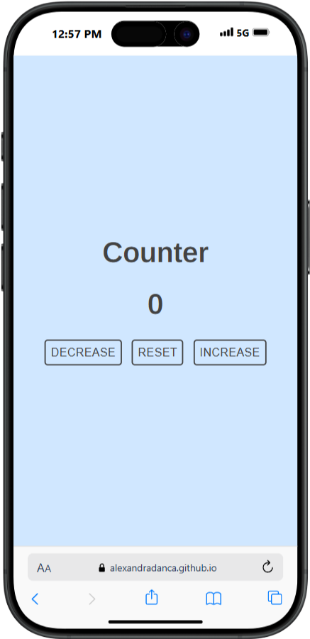

<h2 align="center">
  <a href="https://alexandradanca.github.io/counter/" target="_blank">Counter</a>
</h2>

This is a page that has counter functionality.  It was created during front-end learning journey

## Built With
- HTML
- CSS
- JavaScript

## Features

**🎨 Styled just with CSS**

**📱 Fully Responsive**

<h2>Mockup Phone</h2>

 
  

